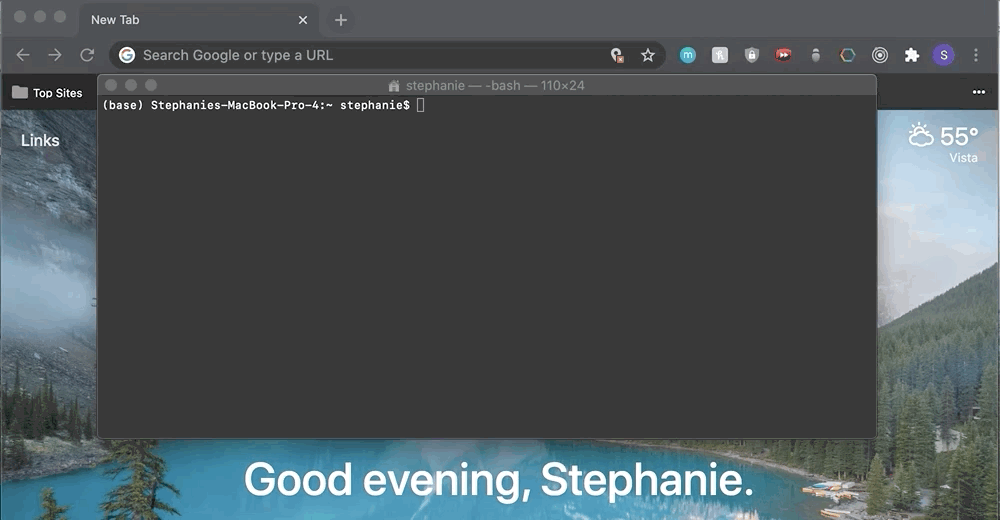

# Welcome to js-nootbook!

Make sure you are running at least node version 14.16.0 in your terminal.

You can access js-nootbook by navigating to your desired working directory in your terminal and inputing the following command:

**npx js-nootbook serve** _[filename].js --port [port number]_

**Notes:**

The bolded part of the command is mandatory. If the italicized part is omitted, the app will default to creating a file with the name **notebook.js** in the current directory of your terminal and will default to running on port **4005**.

**Example:**

npx js-nootbook serve testFile.js --port 7000

This will open a js-nootbook instance that will save content in a file named **testFile.js** in the current directory of your terminal and will run on port **7000**.

# DEMO

**Begin by Checking your Node Version.**

**Setting up the Working Environment and App.**

**Add Text Boxes.**

**Write and Execute Code.**

**Display React Components.**

**Rearrange the Layout.**

**Format your Code.**

